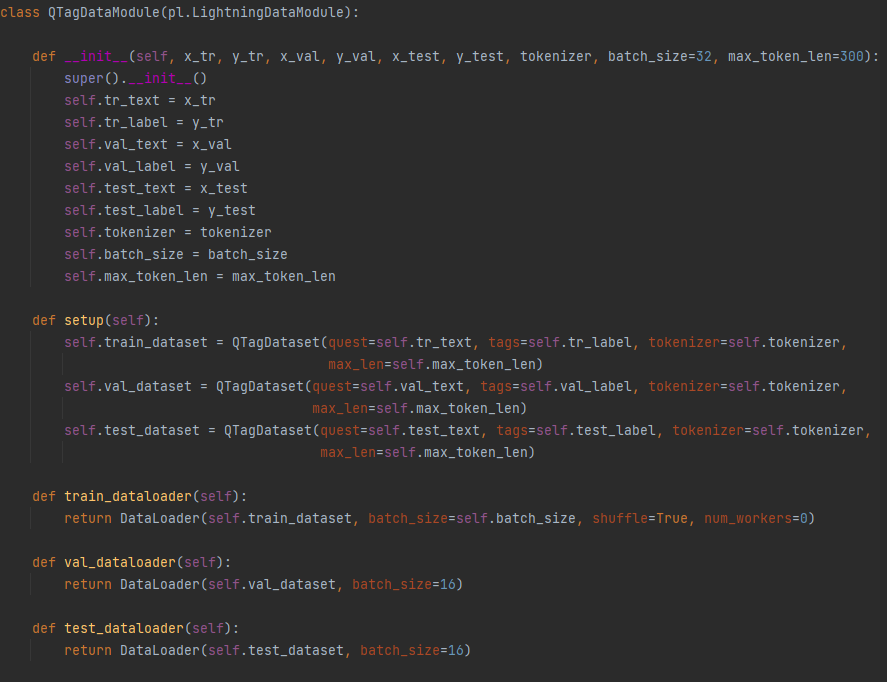
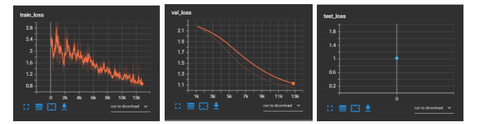

## Model fine-tuning for multilabel classification

This repository aims to document and describe the process required to fine-tune a multi-label classifier based on the BERT-base-cased model (https://huggingface.co/bert-base-cased) from the huggingface repository.

The data that will be used is the Steam Store Games (Clean dataset) from Kaggle (https://www.kaggle.com/datasets/nikdavis/steam-store-games), and will utilise game descriptions to classify each game into respective game labels.

**Full script can be found in classifier_proj2.py**

**Dataset to be used is steam_with_description.csv**

For this classification task, we will utilise a fine-tuned Transformers (bert-based-cased) model with the 
PyTorch Lightning framework for multi label classification of the games description. Example model fine-tuning was run locally
on a laptop equipped with a Ryzen9 5900HX processor, 32GB ram, and a Nvidia RTX3080 GPU with 16GB 
VRAM, utilising the PyCharm IDE.

The main libraries that used are: 

    a) Hugging Face Transformers (BERT model repository and Tokenizer)
    b) PyTorch (DL framework & dataset preparation)
    c) PyTorch Lightning (Model Definition, tracking, and training)
    d) Sklearn (Splitting dataset into train/validation/test & metrics)
    e) BeautifulSoup (removing HTML tags and cleaning of raw text)

Initial cleaning and analysis of the ‘steamspy_tags’ column shows 336 unique tags, many with a very 
low count and of low importance, so we will utilise the Top 20 tags that appeared on all the games for 
our classification labels

From plotting the final top 20 labels to be used for classification, it is noted that there is a class imbalance of the 
occurrence of the labels within the dataset.

The description column for each game is then cleaned utilising BeautifulSoup to remove HTML tags, as 
well as other preprocessing and tokenization for final usage, and a for loop is used to generate the final dataframe required for fine tuning of the pretrained bert model in the 
format as shown above with the 3 columns : ‘name’, ‘desc’ and ‘tags’, with a total of 26436 labelled games in our 
final dataset.

As the machine learning is only able to process numerical data, is is required to encode both the labels (‘tags’ 
column) as well as the text of the description (‘desc’ column) into a numerical format. To encode the labels, we 
will utilise the MultiLabelBinarizer() class from sklearn which transforms the tags into binary format with each unique 
tag given a position. A ‘0’ would mean the absence and a ‘1’ would indicate presence of a tag. As we have 20 labels, 
our label vector will have a length of 20.

As identified previously, due addresss the class imbalance, weights for each label are then assigned based on occurrence. 
The weights will then be fed into the QTclassifier further on which will help handle the class imbalance.

!

As the transformer model can only handle less than 512 words, a quick histogram plot is used to check the length 
of the ‘desc’ columns. It is found that there are only 2233 games which had a description of longer than 500 
words, and thus we will restrict our inputs to the first 500 words. We will then split the dataset into Training, Validation, 
and Test dataset for our usage.

!

To tokenize the description data into numbers in a structured format as well, we will utilize the BERT Tokenizer class 
from the Transformers library. We create the QTagDataset class based on the Dataset class, that will ready the text 
in a format needed for the BERT Model.

As we are using PyTorch Lightning for Model training, we will then set up the QTagDataModule class which is derived 
from the LightningDataModule, and instantiate and set up the data module.

The pretrained BERT model we will build our classifer upon is bert-base-cased, which has already been pretrained on Wikipedia as 
well as Book Corpus. As mentioned previously, due to the steam dataset being highly domain specific, we have to fine-tune the model on the dataset 
as prepared above so that it can achieve better multi-label classification results than the base bert model. As 
the output is multi-labelled we will use the BCEWithLogitsLoss() activation function.

In this text classification task, the BERT Base model which we are employing outputs a vector of length 768 for each 
word as well as for the pooled output (CLS). The pooled output at the end of the model training cycle is able to 
sufficiently gather the context of the task and thus is able to help make predictions. Since our prediction task requires 
probabilities for the labels(tags) that we have identified, we will add a Linear layer of 20 outputs on top of the 768 
outputs from BERT.

Since we are using PyTorch Lightning, which is a high-level framework built on top of PyTorch, we will only need to 
initialize the Hyperparameters for the model training. Additionally, we also can define a checkpoint checkback which allows us to track and save the 
best-performing model. 

The Lightning Trainer handles the training loop details for us, we can 
instantiate the Model Trainer and start the training for finetuning of our model. Training and Validation 
loss will then be tracked with tensorboard.

After every cycle of fine-tuning, the saved models are evaluated on the test dataset. The model with the 
lowest loss will then be further evaluated for classification.

As the classifier outputs a vector of the probability for each class tag, we will utilize a threshold as the final 
decision on whether to roll the result to a 1 or 0. A range of thresholds are evaluated, and the threshold which 
will achieve the best f1 score will be used for the final labelling . The best model shows a 0.92 f1-score for the 0 label, and 0.55 for the 1 label, 
which shows that it very accurately predicted when a label for the game should not be assigned, but only able to 
predict the correct tag slightly more than half the time. Also, the overall fine-tuned model has a 0.87 accuracy. 

Utilizing the best model, we can then start to predict game labels based on any new game description. As an example, we will use the description of "Elden Ring" by From Software.

Based on the actual gameplay, the tags appear to be of decent quality, and able to describe the game accurately.

